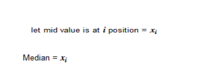
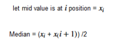
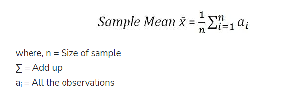
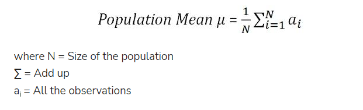

## Welcome to 16DaysofStatisticsCourse

# Day 01
We cover the following topics in Day 01:
* Introduction to descriptive statistics and Inferencial statistics
* Sample vs. Population
* Measures of Central Tendency
* Sample vs. Population Mean

**Statistics**:
* Statistics is the science that deals with methodologies to gather, review, analyze and draw conclusions from data. 
* With specific Statistics tools in hand we can derive many key observations and make predictions from the data in hand.

# Types of Statistics
1. **Descriptive Statistics:**
* Descriptive Statistics deals with numbers (numerical facts, figures, or information) to describe any phenomena.
* Examples are : Reports of industry production, cricket batting averages, government deficits, Movie Ratings etc. 

2. **Inferential statistics:**
* Inferential statistics deals with a decision, estimate, prediction, or generalization about apopulation, based on sample.Here we apply some mathematical formula on descriptive data to get inferences from the data.
*  Inferential statistics is used to make inferences from data whereas descriptive statistics simply describes what’s going on in  data. 

# Population
*  A population is a collection of all possible individual, objects, or measurements of interest. 
# Sample
* A sample is a portion, or part, of the population of interest.

# Measures of Central Tendency
* A measure of central tendency is a summary statistic that represents the center point or typical value of a dataset.
* These measures indicate where most values in a distribution fall and are also referred to as the central location of a distribution.
* We can think of it as the tendency of data to cluster around a middle value.
* In statistics,there are three most common measures of central tendency:
1. mean, 
2. median, 
3. mode
* Each of these measures calculates the location of the central point using a different method.

1. **Mean**
* The mean is the arithmetic average, for calculating the mean just add up all of the values and divide by the number of observations in  dataset.
Let us consider we  have dataset with n values as follows:

Mean for the above data will be given as:

2.**Median**
* The median is the middle value. 
* It is the value that splits the dataset in half. 
* To find the median, order your data from smallest to largest, and then find the data point that has an equal amount of values above it and below it. 
* The method for locating the median varies slightly depending on whether your dataset has an even or odd number of values. 

Let us consider we have dataset with n values as follows:

Case I) When n is **odd**:

Case II) when n is **even**:

**Frequency:**
* The number of times a variable occurs in the data set is called its frequency.

3.**Mode:** 
* The mode is the value that occurs the most frequently in your data set i.e. has the highest frequency.
*  On a bar chart, the mode is the highest bar. 
*  If the data have multiple values that are tied for occurring the most frequently, you have a multimodal distribution. 
*  If no value repeats, the data do not have a mode.
# Sample vs. Population Mean
**Sample Mean**
* The sample mean is the mean calculated from a group of random variables, drawn from the population.
* It is regarded as an efficient and unbiased estimator of population mean which means that the most expected value for the sample statistic is the population statistic, irrespective of the sampling error.
* The sample mean is calculated as below:

**Population Mean**
* Population mean is defined as the average of the all the elements in the population.
* It is a mean of group characteristic, where group refers to elements of the population like items, persons, etc. and the characteristic is the item of interest.
* As the population is very large and not known, the population mean is unknown constant.
* The population mean can be calculated:

      *****************************************************  HAPPY LEARNING  ******************************************************************************

      ***************************************  Feel free to  Star my repo if you like the post  ************************************************************

    *************************************************************  Thanks to Data Science Community ********************************************************************

